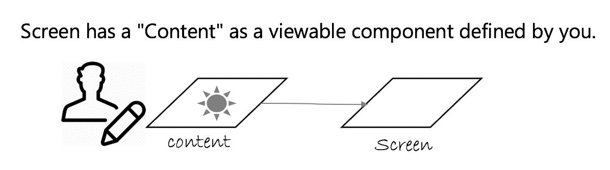

# React Native Zen Router
Router for React Native with simple concept.
(I still cannot prepare README in English now. I'm working on it.)

React Native上で動作し、最小限の概念、最小限のインターフェースを提供、軽量でシンプルに扱えることを目指したルータです。
表示領域は提供せず、ルーティングのために最低限必要な枠組みのみを提供することを優先しています。

# Concepts
登場する主な概念は積み上げ表示されるScreenと、Screenの内容であるContentの２つです。

---

Screenはルータが提供する、アプリケーション表示の土台となるReactコンポーネントです。


---
Contentは、あなたが定義したReactコンポーネントです。


---
 Screenには１つのContentを持つGenericScreenと、複数のContentとTabコンポーネントを持つTabScreenがあります。


---
Routerはスタック構造のScreen群を持つことになります。スクリーン名を指定してpushすることで新しいScreenが積み上げられます。新しいScreenの表示や非表示は縦方向/横方向のアニメーションを都度指定することが出来ます。


# Technical Note
- TypeScriptの型定義を内包しています。FlowTypeの型定義は現在対応していません。

# Installation

```
npm install --save react-native-zen-router
```

# Getting Started

```typescript jsx
import {createGenericScreen, createTabScreen, Router} from 'react-native-zen-router';

// ルートオブジェクトを準備します。
// 下記の"ScreenA","ScreenB"は新しいScreenを生成する時に指定する名前となります。
// ScreenAやScreenBのインスタンスが実際に画面に表示されるScreenです。
const routes: Routes = {
  ScreenA: {
      screen: createGenericScreen({content: ContentX})
  },
  ScreenB: {
    screen: createTabScreen({
      tabType: 'footer',
      tabComponent: FooterTab,
      contentComponents: [
        ContentY,
        ContentZ
      ],
      swipable: true 
    })
  }
};

// ルーティング設定
const config = {
  initialRouteName: 'ScreenA'
};

// ScreenPropsは各Contentで受け取ることができるオブジェクトです
const screenProps = {user, items, cart};

export default class App extends React.Component {
  render() {
    return (
      <Router
        routes={routes}
        config={config}
        screenProps={screenProps}/>);
  }
}
```

# Redux Integration
with [react-redux](https://github.com/reduxjs/react-redux)

Let's give your own `reducer`, `mapStateToProps`, and `mapDispatchToProp` like below. 

```typescript jsx
const store = createStore(reducer);
const AppWithState = (props) =>
  <Router
    routes={routes}
    config={config}
    screenProps={props}/>;
const Connected = connect(mapStateToProps, mapDispatchToProp)(AppWithState);    
        
class App extends React.Component {
  render() {
    return (
      <Provider store={store}>
        <Connected />
      </Provider>
    );
  }
}
```

# API Reference 
https://jshosomichi.github.io/react-native-zen-router/ 

# Execution Example App

```
$ cd react-native-zen-router/
$ yarn install
$ cd ../example/
$ yarn install
$ cd ..
$ yarn code-sync 
$ cd example/
$ react-native run-ios
```

# License
MIT

# How To Contribute
It's not ready yet.

MIT @ <jshosomichi@gmail.com>